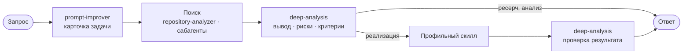

<div align="center">

# skills

**Скиллы для GigaCode и Claude Code: обязательный сценарий из GIGACODE.md, задачи в Jira, русский текст без штампов — плюс подборка для CTF и пентеста.**


[Что это](#что-это) · [Структура](#структура-репозитория) · [Скиллы](#скиллы) · [Как связаны](#как-скиллы-связаны) · [CTF](#ctf) · [Установка](#установка) · [Формат](#формат-скилла) · [Источники](#источники)

</div>

---

## Что это

Личная подборка скиллов для Claude Code. Скилл — это папка с файлом `SKILL.md`:
во frontmatter лежат имя и описание с триггерами, в теле — инструкция для агента.
Claude Code сам читает описания и подключает подходящий скилл, когда задача под него попадает.

В репозитории две части:

- **пять своих скиллов** в папке `skills/` и глобальные правила `GIGACODE.md` для GigaCode:
  обязательный сценарий из трёх шагов, задачи в Jira и русский текст без ИИ-штампов.
- **папка [`ctf/`](ctf/)** — сторонние скиллы для CTF и авторизованного пентеста. Это копии
  внешних репозиториев, каждый прочитан на предмет опасного кода перед добавлением.

## Структура репозитория

```
skills/                    (корень репозитория)
├── GIGACODE.md            глобальные правила: обязательный сценарий из трёх шагов и маршруты скиллов
├── README.md
└── skills/
    ├── prompt-improver/      шаг 1 сценария GIGACODE.md: карточка задачи — цель, граница, критерии готовности
    ├── repository-analyzer/  шаг 2: разбор кода со ссылками путь:строка, поток вызовов, влияние изменения
    ├── deep-analysis/        шаг 3: вывод, факты и источники, риски, сверка с критериями готовности
    ├── jira-ticket/          задача в Jira: четыре блока, черновик в чат, публикация только по прямой команде
    └── write-for-humans-ru/  русский текст без ИИ-штампов, эмодзи и декора, с сохранением фактов
```

Структура повторяет установку в GigaCode: корень репозитория — это `.gigacode\`, папка
`skills/` — это `.gigacode\skills\`. Поэтому ссылки в `GIGACODE.md` работают и на GitHub,
и после установки.

## Скиллы

| Скилл | Для чего |
|---|---|
| [`write-for-humans-ru`](skills/write-for-humans-ru/SKILL.md) | пишет и правит русский текст так, как пишут люди: без штампов, эмодзи, значков и выдуманных фактов |
| [`prompt-improver`](skills/prompt-improver/SKILL.md) | шаг 1 сценария из `GIGACODE.md`: превращает запрос в карточку задачи, вопросы задаёт только после чтения контекста |
| [`repository-analyzer`](skills/repository-analyzer/SKILL.md) | шаг 2: разбирает код до изменений, каждое утверждение со ссылкой `путь:строка`, независимые зоны отдаёт параллельным сабагентам |
| [`deep-analysis`](skills/deep-analysis/SKILL.md) | шаг 3: вывод с фактами, допущениями и неизвестным, риски, сверка с критериями готовности до и после реализации |
| [`jira-ticket`](skills/jira-ticket/SKILL.md) | готовит задачу в Jira из четырёх блоков, показывает черновик и публикует только по прямой команде |

### write-for-humans-ru

Нужен для любого текста, который прочитает человек: сообщение, задача, комментарий к MR, страница документации, письмо, промт.

- Три режима: написать с нуля, переписать чужое с сохранением голоса автора, проверить и показать замены.
- Сначала фиксирует факты, условия, исключения и степень уверенности, потом правит стиль. Не выдумывает числа, сроки и исполнителей.
- Убирает ИИ-штампы, канцелярит, рекламную лексику, ложные противопоставления, служебные обёртки и хвосты помощника.
- Запрещает эмодзи, значки-статусы, стрелки в прозе, декоративные разделители, плашки и жирные подписи перед каждым пунктом.
- Не имитирует живого человека опечатками, сленгом и выдуманным опытом. Хороший текст оставляет как есть.
- Каталог маркеров с примерами правки и исключениями лежит в `references/antipatterns.md`. Автоматической проверки нет: совпадение со словарём ничего не доказывает.

## Как скиллы связаны

`prompt-improver`, `repository-analyzer` и `deep-analysis` работают как одна цепочка из
[`GIGACODE.md`](GIGACODE.md). Шаг 1 собирает карточку задачи, шаги 2 и 3 работают по ней.
После реализации `deep-analysis` ещё раз сверяет результат с критериями готовности из карточки.
Хуков у этих скиллов нет: всё описано в тексте, поэтому они работают и в GigaCode, и в Claude Code.



## CTF

В папке [`ctf/`](ctf/) лежат сторонние скиллы для CTF и авторизованного пентеста —
это копии внешних репозиториев, а не скиллы этого проекта. Перед добавлением каждый
прочитан на предмет опасного кода.

15 скиллов лежат плоско (`ctf/<имя>/`) и ставятся по имени через `npx skills`; набор
`hacking-skills` оставлен плагином со своим графом.

| Источник | Что даёт | Как ставить | Лицензия |
|---|---|---|---|
| [hatrickkkk/ctf-claude](https://github.com/hatrickkkk/ctf-claude) | recon, web, pwn, privesc, docker escape, AD/ADCS (9) | `npx skills … --skill ctf-recon` | не указана |
| [Orizon-eu/claude-code-pentest](https://github.com/Orizon-eu/claude-code-pentest) | весь цикл пентеста, python-скрипты (6) | `npx skills … --skill recon-dominator` | MIT |
| [securityfortech/hacking-skills](https://github.com/securityfortech/hacking-skills) | методики web/mobile/CI-CD, OWASP (43) | `/plugin marketplace add …` | не указана |

Полная установка, итоги проверки безопасности, Kali-MCP и оговорки —
в [`ctf/README.md`](ctf/README.md). Только для авторизованного тестирования и по scope.

## Установка

Репозиторий закрытый, поэтому нужен доступ к нему и авторизация на GitHub через `gh` или SSH-ключ.

```bash
# все скиллы глобально для Claude Code
npx skills add NewaccOOO/skills -a claude-code -g

# один скилл
npx skills add NewaccOOO/skills -a claude-code -g --skill jira-ticket
```

Без `npx` скиллы можно скопировать руками:

```bash
git clone https://github.com/NewaccOOO/skills.git
cp -R skills/skills/* ~/.claude/skills/
```

Для GigaCode (PowerShell): скопировать `GIGACODE.md` и содержимое `skills/` в `.gigacode`.

```powershell
git clone -b no-ctf https://github.com/NewaccOOO/skills.git $env:TEMP\skills
Copy-Item $env:TEMP\skills\GIGACODE.md C:\Users\23882339\.gigacode\GIGACODE.md
robocopy $env:TEMP\skills\skills C:\Users\23882339\.gigacode\skills /E
```

Установка скиллов из `ctf/` — в [разделе CTF](#ctf) и в [`ctf/README.md`](ctf/README.md).

## Формат скилла

Каждый скилл — папка с файлом `SKILL.md`. Frontmatter обязателен: поля `name` и `description`.
В описании перечисляют триггеры — по ним агент понимает, когда скилл нужен. В теле файла лежит
сама инструкция.

Рядом с `SKILL.md` могут лежать вспомогательные файлы, которые скилл читает по ходу работы:

- `references/` — справочные материалы, которые подгружаются по необходимости (например,
  `skills/prompt-improver/references/questions.md`);
- `scripts/` — исполняемые проверки и утилиты;
- шаблоны и ассеты.

Такую раскладку понимают и Claude Code, и CLI `npx skills`. `npx skills` ищет скиллы на глубину
до трёх уровней от корня репозитория или папки `skills/`, поэтому скилл должен лежать не глубже
`ctf/<имя>/SKILL.md`.

## Источники

Свои скиллы:

| Скилл | Откуда | Лицензия |
|---|---|---|
| `write-for-humans-ru` | написан в этом репозитории; маркеры собраны по [Wikipedia: Signs of AI writing](https://en.wikipedia.org/wiki/Wikipedia:Signs_of_AI_writing), [stop-slop](https://github.com/hardikpandya/stop-slop) и [blader/humanizer](https://github.com/blader/humanizer) с адаптацией под русский | не указана |
| `prompt-improver` | написан в этом репозитории; подход «сначала прочитать контекст, потом вопросы с вариантами» взят из [severity1/claude-code-prompt-improver](https://github.com/severity1/claude-code-prompt-improver) (MIT) и скилла `brainstorming` из [obra/superpowers](https://github.com/obra/superpowers) (MIT), хуков здесь нет | не указана |
| `repository-analyzer` | написан в этом репозитории; порядок разбора по мотивам агента `code-explorer` и фазы исследования кода из плагина `feature-dev` в [anthropics/claude-code](https://github.com/anthropics/claude-code), текст свой | не указана |
| `deep-analysis` | написан в этом репозитории; проверка «сначала доказательство, потом заявление о готовности» по мотивам `verification-before-completion` из [obra/superpowers](https://github.com/obra/superpowers) (MIT) | не указана |

Скиллы из `ctf/` — сторонние, с указанием источника и лицензии в [`ctf/README.md`](ctf/README.md).
Два набора там без файла лицензии; по умолчанию все права у их авторов.
