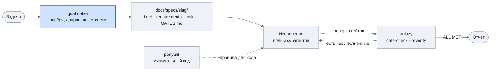

<div align="center">

# skills

**Скиллы для Claude Code: постановка долгих автономных задач, проверяемая готовность и минимальный код.**


[Скиллы](#скиллы) · [Как связаны](#как-скиллы-связаны) · [CTF](#ctf) · [Установка](#установка) · [Источники](#источники)

</div>

---

## Скиллы

| Скилл | Для чего |
|---|---|
| [`goal-setter`](goal-setter/SKILL.md) | готовит долгую задачу для автономного агента: ресёрч, допрос, пакет спеки, промт запуска |
| [`unlazy`](unlazy/SKILL.md) | не даёт агенту сдать работу, пока не выполнены проверяемые критерии готовности |
| [`ponytail`](ponytail/SKILL.md) | заставляет писать минимальное рабочее решение без лишних абстракций и зависимостей |

### goal-setter

Нужен, когда агент будет работать часами без тебя и всё неясное надо выяснить до старта.

- Сначала читает репозиторий, память и прошлые спеки, чтобы не спрашивать то, что можно прочитать.
- Ресёрч запускает параллельными субагентами, находки сводит в `research.md`.
- Допрашивает раундами по 2–4 вопроса и к каждому предлагает рекомендованный вариант.
- Собирает пакет связанных документов в `docs/specs/<slug>/`. Требования, критерии и задачи ссылаются друг на друга по ID.

  | Файл | Что внутри |
  |---|---|
  | `index.md` | список документов, статус пакета, промт запуска |
  | `brief.md` | зачем, цели и не-цели, бюджет, границы автономии |
  | `research.md` | вопросы, находки с источниками, что говорит против |
  | `requirements.md` | истории, критерии приёмки, нефункциональные требования, допущения |
  | `design.md` | решение, интерфейсы, альтернативы, выкатка и откат |
  | `tasks.md` | задачи, контракт и журнал исполнения |
  | `GATES.md` | критерии приёмки в виде команд-проверок `unlazy` |
  | `adr/NNNN-*.md` | записи о решениях, которые трудно откатить |

- Размер пакета подбирает под задачу. Quick: index, brief, requirements, GATES. Standard добавляет research и tasks. Full добавляет design и ADR.
- Критерии приёмки превращает в гейты `unlazy`, которые проверяются командами без человека.
- Выдаёт промт запуска. В свежей сессии ведёт исполнение волнами параллельных субагентов и перепроверяет гейты перед отчётом.

### unlazy

Нужен, когда агент склонен объявить работу готовой на середине.

- До начала работы пишет `GATES.md`: у каждого критерия есть команда `CHECK:` и ожидаемый вывод `EXPECT:`.
- `gate-check.mjs` запускает только одобренные команды. Критерий выполнен, если команда завершилась без ошибки и вывод совпал с ожидаемым.
- Большую задачу раскладывает деревом на подзадачи со своими гейтами и списком файлов. Независимые подзадачи отдаёт параллельным субагентам.
- Перед отчётом перепроверяет все гейты заново (`--reverify`), брошенные критерии перечисляет явно.
- По желанию ставится Stop-хук: он не даёт сессии завершиться, пока гейты не выполнены, и отпускает после шести остановок без прогресса.

### ponytail

Нужен на любой задаче с кодом, чтобы агент не переусложнял.

- Перед кодом проходит лестницу: нужно ли это вообще → есть ли уже в кодовой базе → стандартная библиотека → возможности платформы → установленная зависимость → одна строка → минимальный код.
- Баг чинит в общей функции, через которую идут все вызовы, а не в одном месте из тикета.
- Не упрощает проверку входных данных на границах доверия, обработку ошибок, безопасность и доступность интерфейса.
- Для нетривиальной логики оставляет одну запускаемую проверку.
- Уровни строгости: `lite`, `full` (по умолчанию), `ultra`.

## Как скиллы связаны

`goal-setter` ставит задачу и использует `unlazy` как движок проверок. `ponytail` работает сам по себе и задаёт, сколько кода писать.



## CTF

В папке [`ctf/`](ctf/) лежат сторонние наборы скиллов для CTF и авторизованного пентеста —
это копии внешних репозиториев, а не скиллы этого проекта. Перед добавлением каждый набор
прочитан на предмет опасного кода.

| Набор | Что даёт | Источник | Лицензия |
|---|---|---|---|
| [`ctf-claude`](ctf/ctf-claude/) | recon, web, pwn, privesc, docker escape, AD/ADCS (9 скиллов) | [hatrickkkk/ctf-claude](https://github.com/hatrickkkk/ctf-claude) | не указана |
| [`hacking-skills`](ctf/hacking-skills/) | методики по web/mobile/CI-CD, OWASP WSTG (43 скилла) | [securityfortech/hacking-skills](https://github.com/securityfortech/hacking-skills) | не указана |
| [`claude-code-pentest`](ctf/claude-code-pentest/) | весь цикл пентеста, python-скрипты (6 скиллов) | [Orizon-eu/claude-code-pentest](https://github.com/Orizon-eu/claude-code-pentest) | MIT |

Установка, итоги проверки безопасности и оговорки — в [`ctf/README.md`](ctf/README.md).
Только для авторизованного тестирования и по scope соревнования.

## Установка

Репозиторий закрытый, поэтому нужен доступ к нему и авторизация на GitHub через `gh` или SSH-ключ.

```bash
# все скиллы глобально для Claude Code
npx skills add NewaccOOO/skills -a claude-code -g

# один скилл
npx skills add NewaccOOO/skills -a claude-code -g --skill ponytail
```

Без `npx` скиллы можно скопировать руками:

```bash
git clone https://github.com/NewaccOOO/skills.git
cp -R skills/goal-setter skills/unlazy skills/ponytail ~/.claude/skills/
```

| Скилл | Что нужно |
|---|---|
| `goal-setter` | `unlazy` в `~/.claude/skills/unlazy`, Python 3, Node.js 16+ |
| `unlazy` | Node.js 16+ |
| `ponytail` | ничего |

## Источники

| Скилл | Откуда | Лицензия |
|---|---|---|
| `goal-setter` | написан в этом репозитории | не указана |
| `unlazy` | [Leonxlnx/unlazy](https://github.com/Leonxlnx/unlazy), добавлен раздел про параллельных субагентов | MIT |
| `ponytail` | [DietrichGebert/ponytail](https://github.com/DietrichGebert/ponytail), только сам скилл: хука плагина и дополнительных команд здесь нет | MIT |
